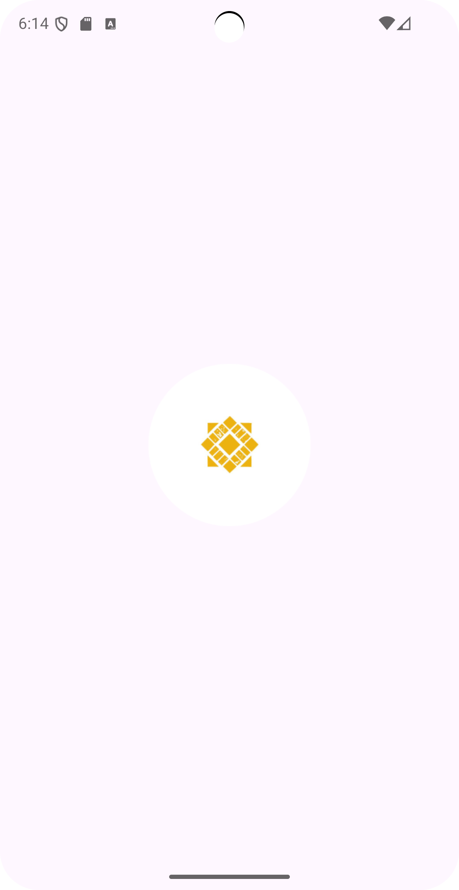
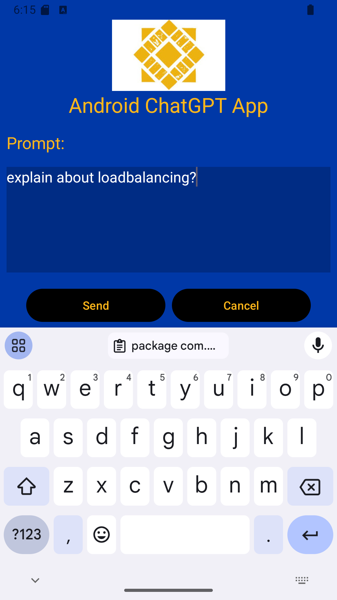
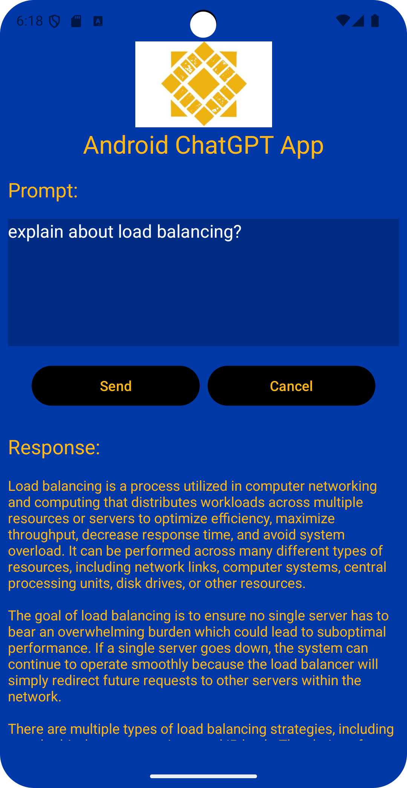

# Android ChatGPT App

This Android application allows users to send prompts to ChatGPT and receive AI-generated responses. The UI is designed with simplicity and ease of use in mind. Below are the screens and a brief explanation of each component.

### 1. Logo Screen

This is the initial screen displayed when the app is launched. The screen features the application logo and serves as a loading or splash screen while the app initializes. 

**Purpose**: 
- It provides a visually appealing first impression.
- Gives the app some time to load the necessary resources.

### 2. Query Input Screen

In this screen, the user is presented with a text input field labeled "Prompt" where they can enter their query or request for information. The screen has two buttons:
- **Send**: To submit the query.
- **Cancel**: To clear the input or abort the request.

**Purpose**: 
- To capture the user's input and send it for processing.
- The app's AI backend processes the request and returns a response.

### 3. Response Screen

### Key Components of the App
- **Splash Screen (Logo)**: Displays while the app is loading.
- **Prompt Input**: Accepts the user's query.
- **Response Display**: Displays the AI-generated answer in a user-friendly format.
